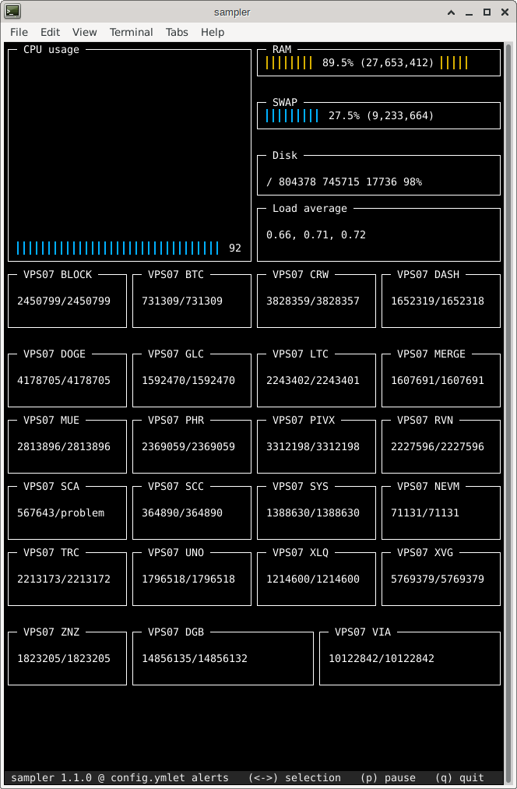

# monitors
## Monitor sources for sampler. 

This collection of (mostly) shell scripts is primarily intended for 
use by Blocknet servicenode operators.
When used in conjunction with 
[sampler](https://github.com/sqshq/sampler)
they provide rudimentary monitoring of the XBridge wallets in use by
a servicenode and allow for detection of potentially mis-synced 
wallets.    



Each script monitors one particular blockchain and reports the local 
height and the height at "the explorer". The two values are separated by
a slash character, for example `2450806/2450805`. If the block height
is unavailable at either source then the height at that source is
shown as `problem`.

Any height difference greater than, say, three blocks, is worthy of 
investigation. Chainz explorers often lag the true block count by 
one to three blocks, especially for chains with one-minute block times. 
If sampler/monitors reports a block height difference you could use these
[unfork](https://github.com/walkjivefly/unfork) 
scripts to find and potentially correct a forked chain.

**Note:** explorers are not infallible Oracles and are just as likely 
to be on the wrong chain, or otherwise out of sync, as any other other 
node. But they are generally the only well known source of blockheight
information, and being external to the local chain, a useful point for
comparison.

In addition to the individual monitoring scripts this repo includes a 
sample configuration file.

In the future there will probably be a more comprehensive monitoring
package, perhaps built using Grafana and Prometheus and with automatic
generation of configuration information based on the choices made 
while running
[awesome builder](https://github.com/blocknetdx/exrproxy-env/blob/master/builder.py).

This repo does not include a copy of sampler because the two projects 
use different licences.

## Usage.

* Either clone the [sampler](https://github.com/sqshq/sampler)
repo or create a new directory and install the appropriate executable 
from the 
[latest release](https://github.com/sqshq/sampler/releases/tag/v1.1.0)
for your platform in it.

* Copy some or all of the height_xxx.sh scripts to the same directory
as the sampler executable.

* Copy sample.yml to config.yml and customise it for your environment.
The sample config is optimised for an 80x56 terminal window. It will 
operate in a different size window but the results may not be visually
appealing. Refer to the 
[sampler documentation](https://github.com/sqshq/sampler/blob/master/README.md) 
for more details.

* Run the monitor by
```
./sampler --config=config.yml
```

## Assumptions.
The monitor scripts were created in a non-containerised, non-EXR 
environment. Consequently they assume that `coin-cli` will talk 
directly to coin. In a containerised, EXR environment the scripts 
could be modified to send `coin-cli` commands to the appropriate
Docker container, or wrapper scripts could be created to take care
of the redirection.

For example, if Bitcoin is running in a container in an environment
installed by
[exrproxy-env](https://github.com/blocknetdx/exrproxy-env)
then you could replace a call to 
```
bitcoin-cli getblockcount
```
by
```
docker exec exrproxy-env_BTC_1 bitcoin-cli getblockcount
```
or you could create a `bitcoin-cli` script with the following 
contents and place it somewhere in PATH.
```
#!/bin/bash
docker exec exrproxy-env_BTC_1 bitcoin-cli $*
```

## Caveats.
The samples here include block height monitoring scripts for a number
of unsupported (by Blocknet) coins. 
Specifically, ALQO (XLQ), Crown (CRW) and Merge (MERGE) are not
(currently) supported by BlockDX or Blocknet.

Additionally, some of the scripts are 
servicenode/masternode/systemnode-aware. If the coin is running as
one of those node types the script checks if the node is online/started 
and if not, reports the status instead of the block height.
## Extending monitoring.

`sampler` is capable of monitoring anything you can generate values for.

Block height scripts are provided for several "popular" chains and can 
be used as templates for other chains. Many of them rely on the Chainz
explorers provided by [CryptoID](https://chainz.cryptoid.info/). Any 
chain supported by them would be trivially easy to add to monitoring.
Be aware that some explorers enforce rate-limiting and could block
your requests if you exceed their limits.

Some chains do not have freely available public explorers but may have
organisations offering paid access. In this case the data will most 
likely be available with an API key which will have to be added to the
`curl` call. Rate-limiting is less likely to be an issue with paid
API access. 

An alternative to paying for API access to a third party explorer could
be to compare heights between multiple copies of a chain you run on
more than one servicenode. 

Another possibility is to simply make an 
`blocknet-cli xrGetBlockCount coin count` call to the servicenode network
for each coin you're interested in, specifying
a node count larger than one and hoping the consensus answer is correct.
Historically there have been many times when the servicenode consensus
for a particular chain was incorrect so I have chosen not to take this
approach. Perhaps in the future when the network is larger and the majority
of servicenode operators realise the importance of keeping their wallets
correctly synced, this will be a more viable alternative.

Yet another possibility is for the monitor to report the local chain 
height, explorer chain height and servicenode consensus height. 

If you do extend the monitoring, either through external scripts or 
inline code in the sampler config, please consider contributing them
to the servicenode operator community through a pull request to this
repo. 

# MIT License
Copyright (c) 2021-2022, Mark Brooker mark@walkjivefly.com

Permission is hereby granted, free of charge, to any person obtaining a copy of this software and associated documentation files (the "Software"), to deal in the Software without restriction, including without limitation the rights to use, copy, modify, merge, publish, distribute, sublicense, and/or sell copies of the Software, and to permit persons to whom the Software is furnished to do so, subject to the following conditions:

The above copyright notice and this permission notice shall be included in all copies or substantial portions of the Software.

THE SOFTWARE IS PROVIDED "AS IS", WITHOUT WARRANTY OF ANY KIND, EXPRESS OR IMPLIED, INCLUDING BUT NOT LIMITED TO THE WARRANTIES OF MERCHANTABILITY, FITNESS FOR A PARTICULAR PURPOSE AND NONINFRINGEMENT. IN NO EVENT SHALL THE AUTHORS OR COPYRIGHT HOLDERS BE LIABLE FOR ANY CLAIM, DAMAGES OR OTHER LIABILITY, WHETHER IN AN ACTION OF CONTRACT, TORT OR OTHERWISE, ARISING FROM, OUT OF OR IN CONNECTION WITH THE SOFTWARE OR THE USE OR OTHER DEALINGS IN THE SOFTWARE.